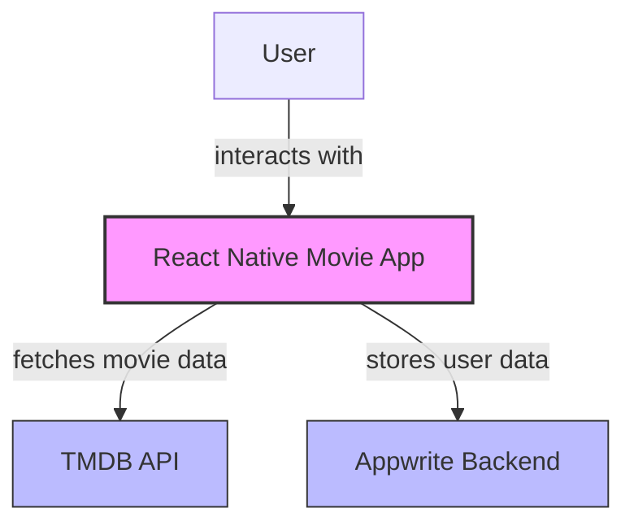
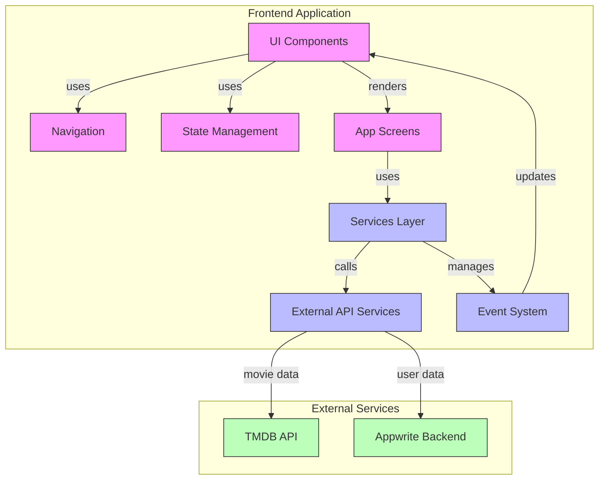
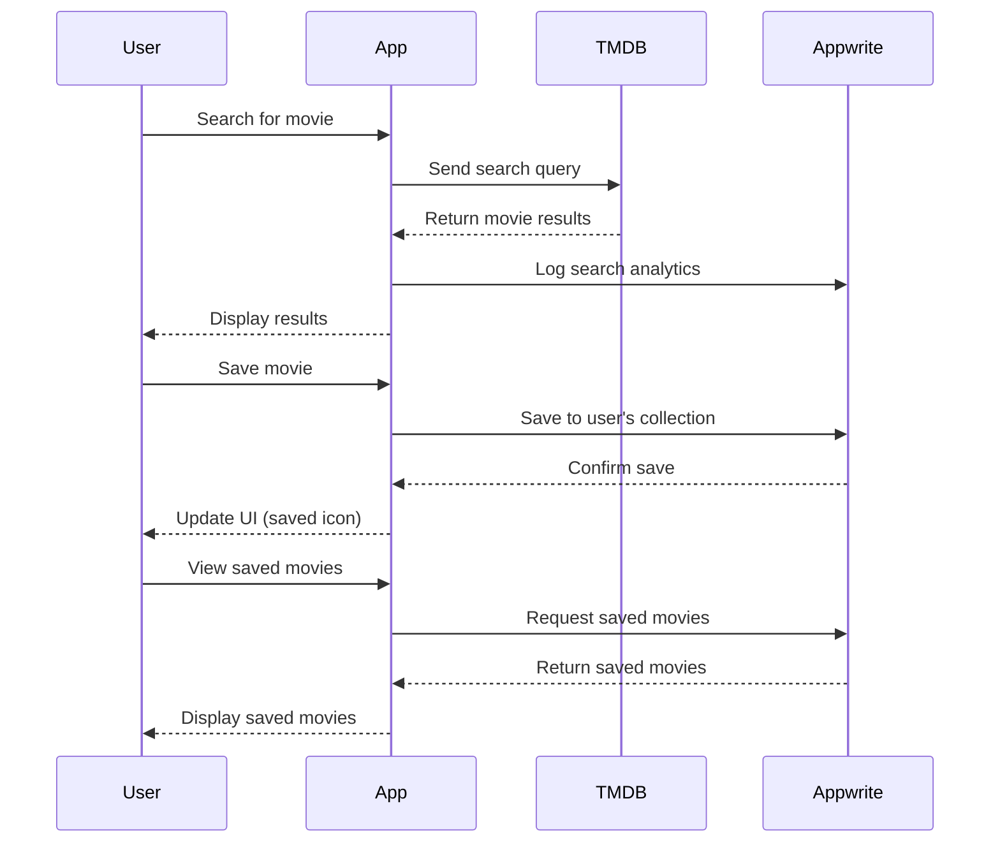
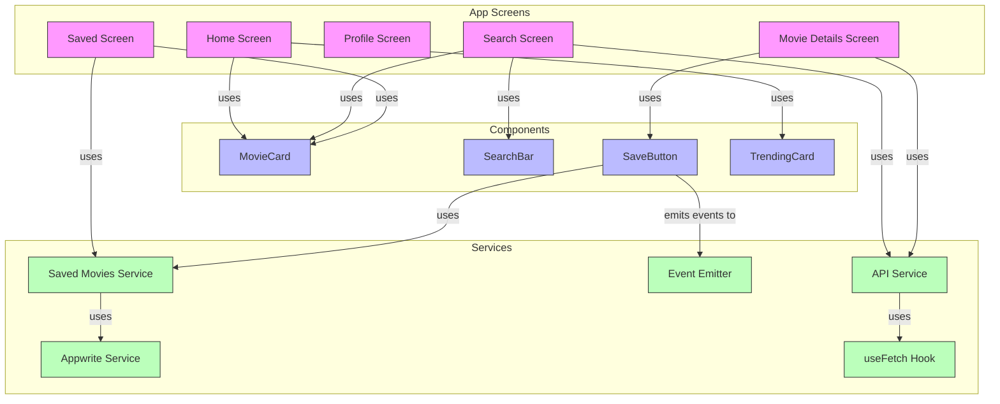

# Architecture Diagrams for React Native Movie App

## System Context Diagram

```mermaid
graph TD
    User[User] -->|interacts with| App[React Native Movie App]
    App -->|fetches movie data| TMDB[TMDB API]
    App -->|stores user data| Appwrite[Appwrite Backend]

    classDef system fill:#f9f,stroke:#333,stroke-width:2px;
    classDef external fill:#bbf,stroke:#333,stroke-width:1px;

    class App system;
    class TMDB,Appwrite external;
```

## Component Diagram

```mermaid
graph TD
    subgraph "Frontend Application"
        UI[UI Components] -->|uses| Navigation[Navigation]
        UI -->|uses| State[State Management]
        UI -->|renders| Screens[App Screens]
        Screens -->|uses| Services[Services Layer]
        Services -->|calls| ExternalAPI[External API Services]
        Services -->|manages| Events[Event System]
    end

    subgraph "External Services"
        ExternalAPI -->|movie data| TMDB[TMDB API]
        ExternalAPI -->|user data| Appwrite[Appwrite Backend]
        Events -->|updates| UI
    end

    classDef frontend fill:#f9f,stroke:#333,stroke-width:1px;
    classDef services fill:#bbf,stroke:#333,stroke-width:1px;
    classDef external fill:#bfb,stroke:#333,stroke-width:1px;

    class UI,Navigation,State,Screens frontend;
    class Services,ExternalAPI,Events services;
    class TMDB,Appwrite external;
```

## Data Flow Diagram

```mermaid
sequenceDiagram
    participant User
    participant App
    participant TMDB
    participant Appwrite

    %% Search Flow
    User->>App: Search for movie
    App->>TMDB: Send search query
    TMDB-->>App: Return movie results
    App->>Appwrite: Log search analytics
    App-->>User: Display results

    %% Save Movie Flow
    User->>App: Save movie
    App->>Appwrite: Save to user's collection
    Appwrite-->>App: Confirm save
    App-->>User: Update UI (saved icon)

    %% View Saved Movies
    User->>App: View saved movies
    App->>Appwrite: Request saved movies
    Appwrite-->>App: Return saved movies
    App-->>User: Display saved movies
```

## Component Structure

```mermaid
graph TD
    subgraph "App Screens"
        Home[Home Screen]
        Search[Search Screen]
        Profile[Profile Screen]
        Saved[Saved Screen]
        MovieDetails[Movie Details Screen]
    end

    subgraph "Components"
        MovieCard[MovieCard]
        SearchBar[SearchBar]
        SaveButton[SaveButton]
        TrendingCard[TrendingCard]
    end

    subgraph "Services"
        API[API Service]
        AppwriteService[Appwrite Service]
        EventEmitter[Event Emitter]
        UseFetch[useFetch Hook]
        SavedMovies[Saved Movies Service]
    end

    Home -->|uses| MovieCard
    Home -->|uses| TrendingCard
    Search -->|uses| SearchBar
    Search -->|uses| MovieCard
    Search -->|uses| API
    Saved -->|uses| MovieCard
    Saved -->|uses| SavedMovies
    MovieDetails -->|uses| SaveButton
    MovieDetails -->|uses| API

    API -->|uses| UseFetch
    SaveButton -->|uses| SavedMovies
    SavedMovies -->|uses| AppwriteService
    SaveButton -->|emits events to| EventEmitter

    classDef screens fill:#f9f,stroke:#333,stroke-width:1px;
    classDef components fill:#bbf,stroke:#333,stroke-width:1px;
    classDef services fill:#bfb,stroke:#333,stroke-width:1px;

    class Home,Search,Profile,Saved,MovieDetails screens;
    class MovieCard,SearchBar,SaveButton,TrendingCard components;
    class API,AppwriteService,EventEmitter,UseFetch,SavedMovies services;
```
